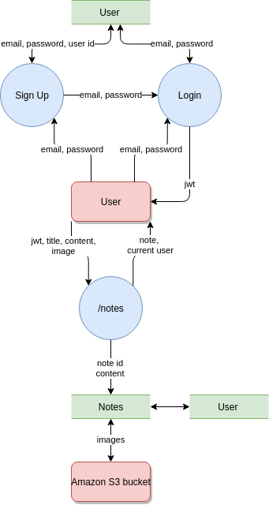
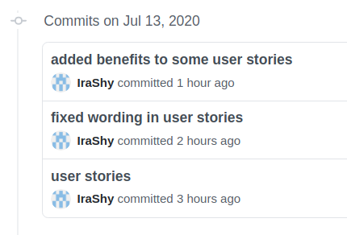
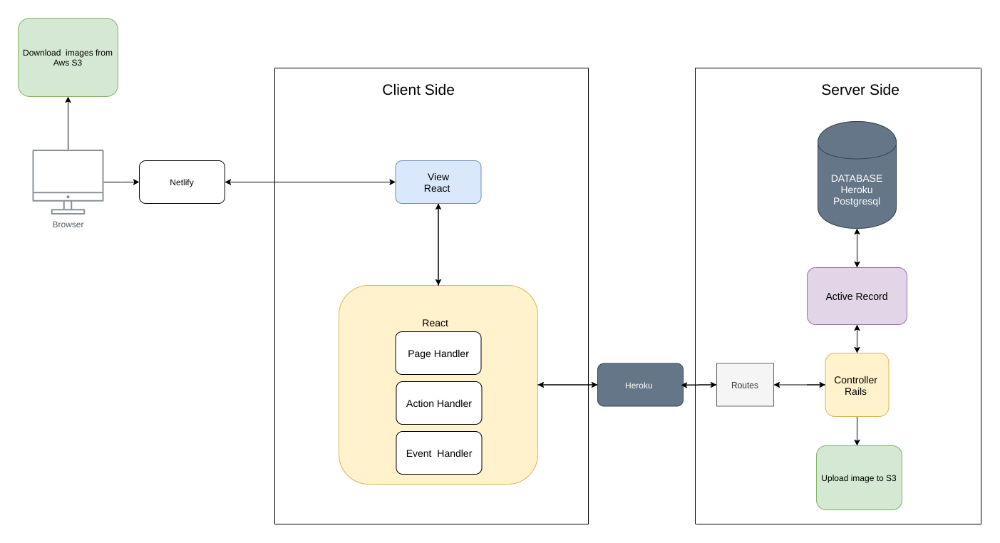
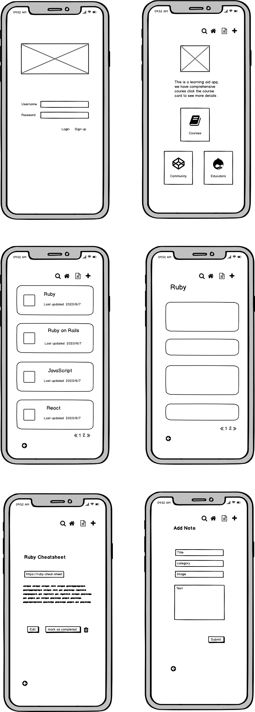
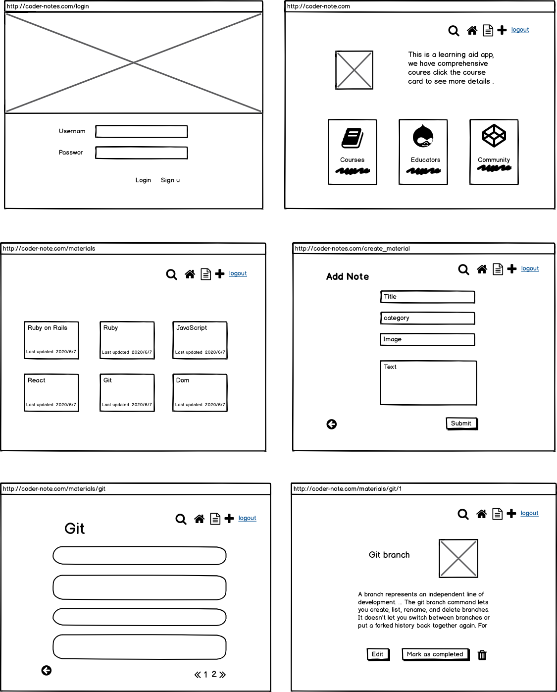
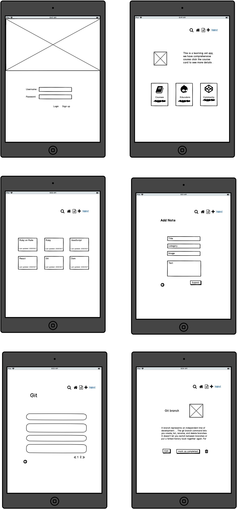
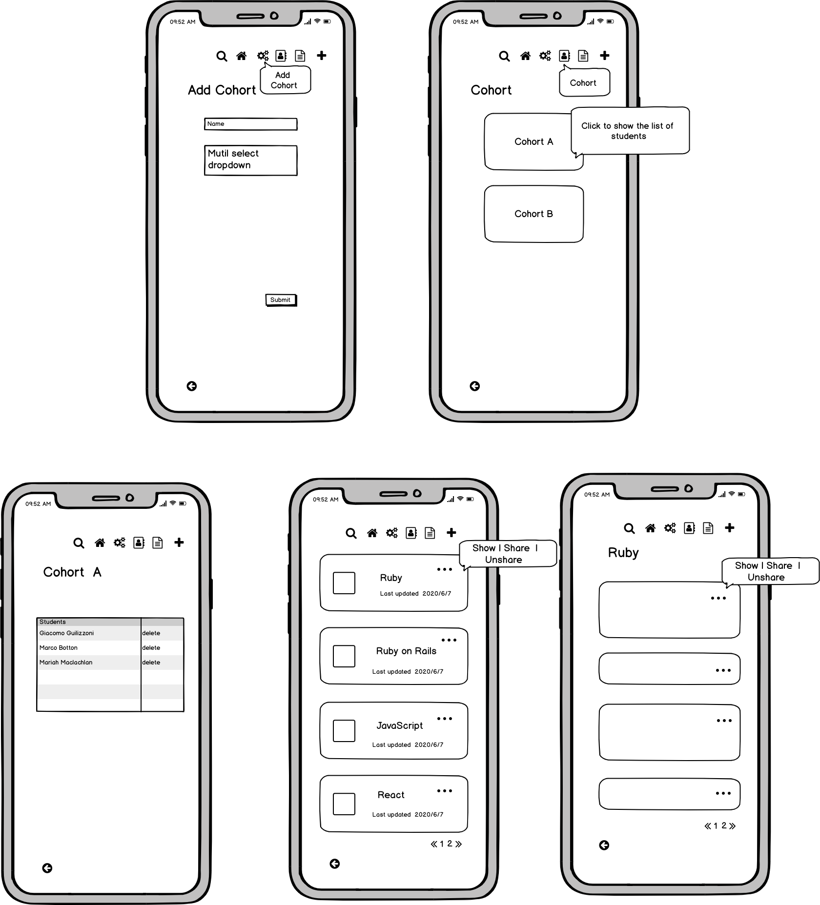
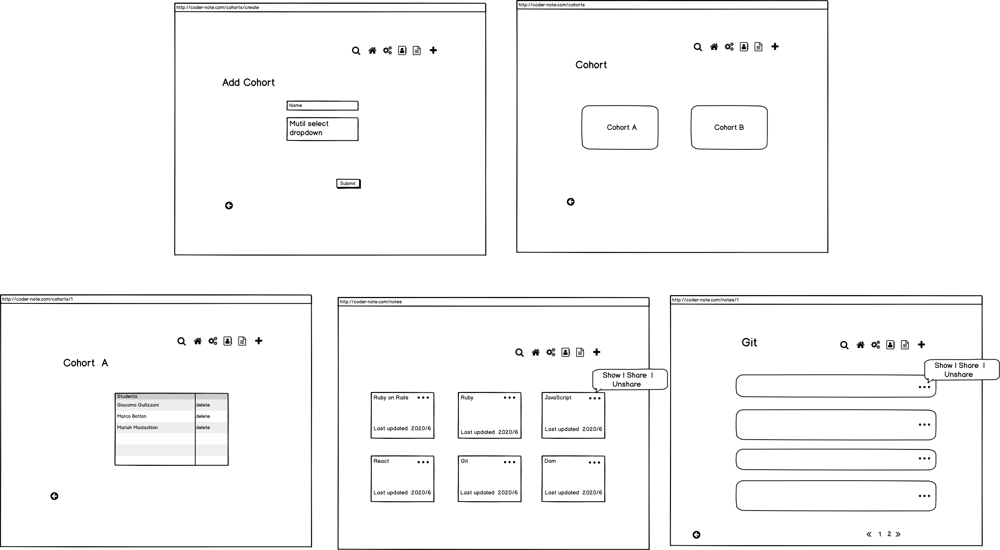
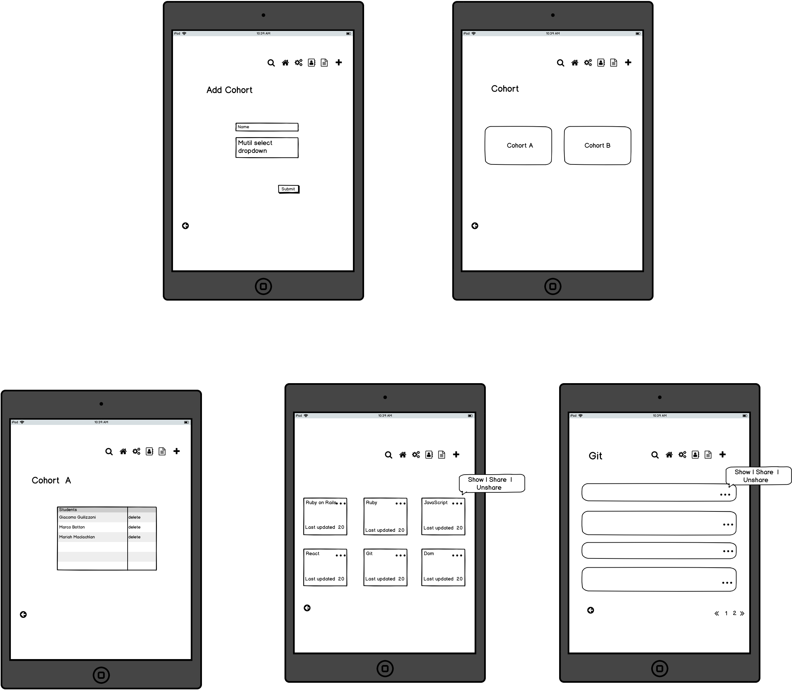

# README

## Links 

### Link to Website 

Client side: https://shorties-app.netlify.app

Back end: https://shorties-server.herokuapp.com

### Test users to start test website contents:

teacher Alice:  email: "teacher1@g.com", 
                password: "shorties730", 

teacher Winter:  email: "teacher2@g.com",
                 password: "shorties2020730",

student Harry:   email: "test2@g.com",
                password: "730test2",

student Sam:  email: "test3@g.com", 
              password: "730test3"

### Link to Repo

Client side repo: https://github.com/IraShy/Shorties-app-client

Server side repo: https://github.com/jishan33/Shorties-app-server

### Link to manual testing spreadsheet
https://docs.google.com/spreadsheets/d/1vV4mRKybSfsh1ajtmJ3ckVwjlnzvinrlzmNVncFHiQI/edit?usp=sharing

## Instruction for Setup 

### System Dependencies

#### Rails 
- rails 6.0.3
- bundler 2.1.2

#### React 
- react-scripts 3.4.1
- yarn 1.22.4

### Credentials 

#### Rails
```
aws:
  access_key_id: <secret>
  secret_access_key: <secret>

recaptcha:
  site_key: <secret>
  secret_key: <secret>

```
To regenerate credentials, follow [these steps](https://gist.github.com/db0sch/19c321cbc727917bc0e12849a7565af9).


#### React
- create .env file in the root of the front-end project, add the following line:
```
REACT_APP_BACKEND_URL=https://shorties-server.herokuapp.com
```
- create .env.development in the root of the front-end project, add the following line:
```
PORT=8080
REACT_APP_BACKEND_URL=http://localhost:3000
```

## Running Code & Tests
### Rails
 - To install dependencies   `bundle install`
 - To run the tests   `./bin/rspec`
 - To start the app   `rails s`

 ### React
  - To install dependencies  `yarn install`
  - To run the tests  `yarn run e2e`
  - To start the app  `yarn start`

## Libraries 

### Rails 
 - RSpec 
 - Factory Bot Rails
 - Knock
 - JWTs
 - Cors
 - Recaptcha
 - Aws

 ### React 

 - Context
 - Cypress 
 - React Router Dom
 - React ReCaptcha Google
 - Lodash
 - Prop Types
 - moment
 - React Bootstrap
 - Joi browser
 - React Select
 - SASS
 - React Animations


## Link to postman 

  https://documenter.getpostman.com/view/10733565/T1DteFk7?version=latest


# Shorties App (Planning Phase)


###### Image by <a href="https://pixabay.com/users/geralt-9301/?utm_source=link-attribution&amp;utm_medium=referral&amp;utm_campaign=image&amp;utm_content=607479">Gerd Altmann</a> from <a href="https://pixabay.com/?utm_source=link-attribution&amp;utm_medium=referral&amp;utm_campaign=image&amp;utm_content=607479">Pixabay</a>
## Description

**Purpose**

The website is to help coder students keep and find quick helpful references for the study material, such as which command to run in a certain situation, or what parameters or properties to use, etc. This is kind of a reference work for novice coders.

The application should help students with time management: they don't need to go through the entire class notes to find a particular reference - they have everything gathered in one app.

Contents has two parts: created by teachers and shared with all students, and personal additions. Teachers can control their content only. Users have full control over their own content, and they can hide teachers content if they don't need it. Students' content is confidential, i.e. only the author can see and change their notes.

**Functionality / features**

We had a lot of discussion regarding features and functionality, and every time there was something new to discuss. It helped us understand the future app much better as we were trying to see how it would function in different situations.

Shorties app allows two types of users: common users (students) and admin users (teachers). Teachers can form cohorts. 

1. **Categories.** All users can add categories. 

2. **CRUD functionality.** All users are able to add notes and assign them to categories, and edit and delete their own notes.

3. **Share.** Teachers can share categories and notes with cohorts. Teachers can also unshare notes.

4. Students are able to create, update, and delete their own categories.

5. Students can add their own notes to any category they want (their own and shared categories). 

6. **Hiding a note feature.** A student can mark a shared note as completed, this will make the note invisible for the student.

7. **Pictures.** Users are able to upload pistures, the app uses AWS S3 bucket to store the pictures.

8. **Searching.** Users are able to search for a note.


**Extra Features**

These features will be implemented if timeframe allows.

- Slack integration 
- Favorite category 


**Target audience**

Target audience is computer science students, coder students, including coding bootcamp students.

The application can also be easily utilised at a working place, with junior developers as target audience.


**Tech stack**

The application is created using Ruby on Rails for server side, React for client side, and Postgresql as a relational database. The RSpec is used for rails testing. 


**Third party services**

- Netlify
- Heroku
- Amazon S3 bucket
- reCAPTCHA


---
## Dataflow Diagram



---
## User stories


###### Image by <a href="https://pixabay.com/users/Gogry-306554/?utm_source=link-attribution&amp;utm_medium=referral&amp;utm_campaign=image&amp;utm_content=4320498">Jonggun Go</a> from <a href="https://pixabay.com/?utm_source=link-attribution&amp;utm_medium=referral&amp;utm_campaign=image&amp;utm_content=4320498">Pixabay</a>
### **Sam**
Sam is a new Coder Academy student, he started his Fast Track course a month ago, switching from a hairdressing job. He is following his old dream and is proud of himself and even a bit surprised how well he is doing. He has learned a lot! But it gets confusing at times.

They started learning HTML and CSS. Sam finds it challenging to remember what commands go where with the flexbox. It is not easy indeed, one of Sam’s classmates even started dabbing! By the end of the week, Sam is feeling more and more confused.
“Should I use inline-block or flex-box? What was changing with flex-direction again? Will I ever be able to remember all this? I really need to make a cheat sheet!”

There is an app he can use - *Shorties*. It allows teachers to add some helpful bits and pieces for students to refer to. Also, students are able to create their own notes and cheat sheets, and add to existing or new categories.

### **Sam’s stories**
1. As a student user, I want to be able to see content that my teachers shared with my cohort.
2. As a student user, I want to be able to hide that content if I don’t need it anymore, so that my notes only contain what I need.
3. As a user, I want to be able to easily navigate through the app.
4. I want the app to be intuitive; at every step of using it, I want to understand what I should do.


### **Harry**

Harry is Sam’s classmate in Coder Academy. He continues working part-time while studying and is always in a rush. Harry is married with two kids and is not able to remember his own name by the end of the week.

He understands material and generally does pretty well, although he forgets some routines and has to search for them in his lesson notes over and over again. He says to his wife: “My brain is like a sieve, I am always forgetting something! I really need to have all my cheat sheets and shortcuts somewhere in one place, looking for them is taking forever.”

### **Harry’s stories**
1. As a student user, I want to be able to create new categories, so that I am not limited by shared categories.
2. As a student user, I want to be able to add my own custom notes and images to any category I want, so that my content is as useful to me as possible.
3. As a student user, I want to be able to edit and delete my own notes.
4. As a user, I want to be able to search for a particular note, so that I don't have to spend too much time browsing the app.
5. As a student user, I want to log in and out.
6. I want to only be able to see my notes when I am logged in, so that only I have access to my notes.


### **Alice**

Alice is a teacher at Coder Academy. She used to be a bootcamp student and remembers very well how overwhelming the amount of information can be. 

She needs a cheat sheet app to help her students keep all the relevant shortcuts together. Alice doesn’t want it to be another Canvas or anything massive, it should be just a quick reference to help students recall a particular command or routine. 

### **Alice’s stories**

1. As an admin and a teacher user, I want to be able to login securely to my account.
2. As a teacher user, I want to be able to create a cohort and add other users to the cohort.
3. As a teacher user, I want to be able to create categories and add notes to the categories.
4. As a teacher user, I want to be able to share and unshare the notes and categories with a cohort.
5. As an admin user, I want to be able to edit and delete shared notes and categories.
6. As an admin, I want other (non admin / teacher) users to not be able to edit or delete shared notes, so that shared content stays reliable and adequate.


###### Image by <a href="https://pixabay.com/users/Gogry-306554/?utm_source=link-attribution&amp;utm_medium=referral&amp;utm_campaign=image&amp;utm_content=4320495">Jonggun Go</a> from <a href="https://pixabay.com/?utm_source=link-attribution&amp;utm_medium=referral&amp;utm_campaign=image&amp;utm_content=4320495">Pixabay</a>

We reviewed and discussed our user stories several times as a team and added some additional stories and benefits to represent the app features from different users' point of view.



---
## Application Architecture Diagram



---
## Wireframes 

### Mobile Version



### Webiste Version


### Ipad Version


## Admin Differences

### Mobile Version 


### Website Version 


### Ipad Version 


The wireframes have been revised after reviewing user stories, the original idea of making some notes (the materials passed down from educators)invisible has been changed to mark the note as completed, hence it will not show up in the notes' feed, unless you search for it. 

The reason for changing invisible to completed is that the logic for the code will be more clear and resuable as the completed note can be recovered when you filter the note with mark as completed.


